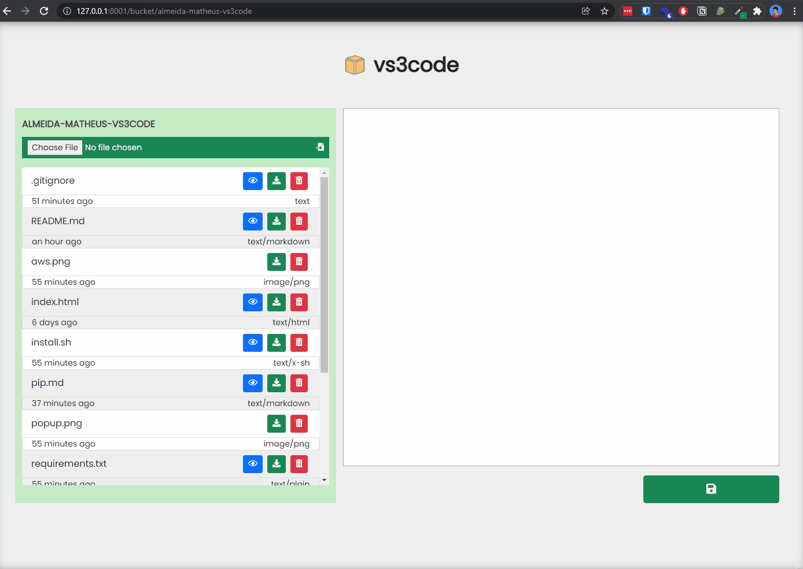

<div align="center">
  
</div>

<details open="open">
  <summary>Table of Contents</summary>
  <ol>
    <li><a href="#about">About</a></li>
    <li><a href="#usage">Usage</a></li>
    <li><a href="#installation">Installation</a></li>
    <li><a href="#contributing">Contributing</a></li>
    <li><a href="#license">License</a></li>
  </ol>
</details>

## About
Web application that works as a text and file manager integrated with AWS S3 buckets.
 
### Functionalities
- List buckets and objects
- Read objects
- Update objects
- Download objects
- Upload objects
- Delete objects

### Built With

- **Back**: Python3 with Flask
- **Front**: HTML with Jinja2 and CSS

## Usage

1 - Select your bucket s3.


2 - Consume and interact with objects from s3 bucket easily with vs3code interface.



### AWS Policy

AWS Policy with minimum requirements:
```json
{
  "Version": "2012-10-17",
  "Statement": [
    {
      "Sid": "S3",
      "Effect": "Allow",
      "Action": [
        "s3:ListAllMyBuckets",
        "s3:ListBucket",
        "s3:GetObject",
        "s3:PutObject",
        "s3:DeleteObject"
      ],
      "Resource": "*"
    }
  ]
}
```

## Installation

#### 1. Install python and pip
```
sudo apt install python3 && python3-pip
```

#### 2. Clone git repository
```
git clone https://github.com/almeida-matheus/vs3code
```

#### 3. Install requeriments
```
pip3 install vs3code/requeriments.txt
```

#### 4. Edit project settings
```
# Open settings file
vim vs3code/config.py

# Add access key and secret key of service user.
AWS_ACCESS_KEY_ID = 'xxxx'
AWS_SECRET_ACCESS_KEY = 'xxxx'

# save the file
```

#### 5. Run the application
```
python3 vs3code/app.py
```
The web application will be available at address [**`http://127.0.0.1:8001/bucket`**](http://127.0.0.1:8001/bucket)

## Contributing
1. Fork the project
2. Create your branch (`git checkout -b branch-name`)
3. Add your changes (`git add .`)
4. Commit your changes (`git commit -m 'add some feature'`)
5. Push to the branch (`git push origin branch-name`)
6. Open a pull request

## License
Distributed under the MIT License. See [LICENSE](LICENSE) for more information.